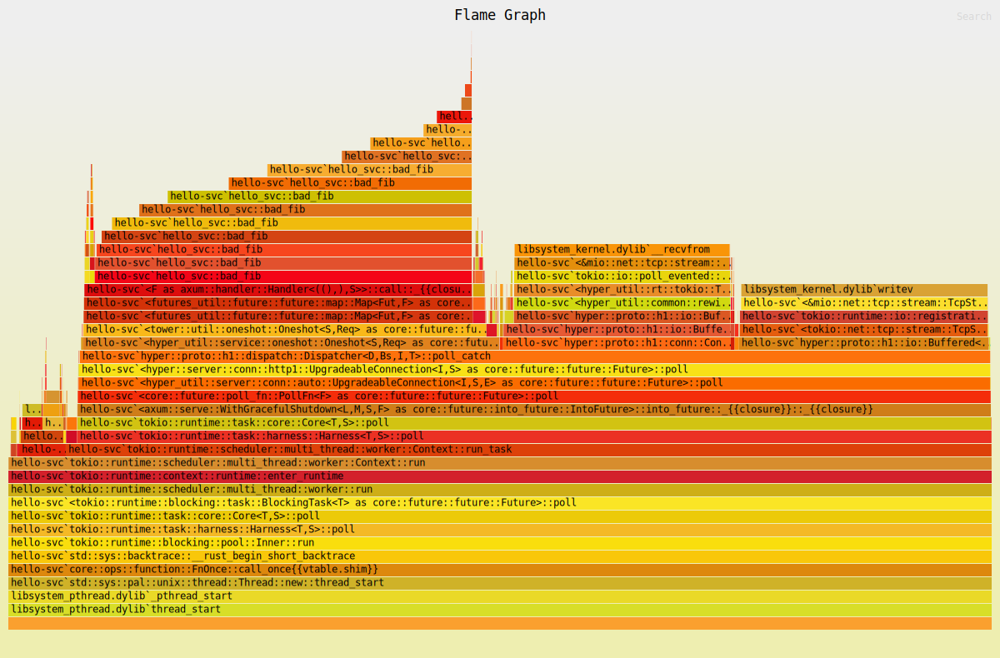

# Performance Examples in Rust

In this talk, we'll go over a few useful technologies for analyzing and
enhancing performance in Rust.

## Criterion

Criterion is a benchmarking tool that lets us write benchmarks (both simple and complicated). Criterion has *many* features.

[Read the Criterion Docs Here](https://bheisler.github.io/criterion.rs/book/)

Examples in this crate:

- 4 versions of a calculator for the [Fibonacci sequence](https://en.wikipedia.org/wiki/Fibonacci_sequence)
    - `perfrs::fib::fib_recursive()` - A very slow implementation, using recursion (~10 micro seconds).
    - `perfrs::fib::fib_iterative()` - A much faster implementation, using iteration (~6 ns).
    - `perfrs::fib::fib_lookup()` - An even faster implementation (~700 ps).
- 2 versions of a Python calculator for comparison.
    - `scripts/bench_fib_20.py` - Using recursion (~520 microseconds).
    - `scripts/bench_fib_better.py` - Using lookup (~13.8 ns).

The benchmarks are held in `benches/fib_bench.rs`. They can be run with either `cargo`'s default bench runner:
```bash
cargo bench
```

Or the Criterion runner:
```bash
# Install with:
cargo install --locked cargo-criterion

# Run with:
cargo criterion
```

There is text output in the terminal, and HTML reports in `target/criterion/report/index.html`.

## Oha

Next we moved on to a slightly bigger example: a hello-world microservice made with Axum.

The service is located in `src/main.rs`. You can run it with:
```bash
# Start the service
cargo run --release

# Query the service
curl 127.0.0.1:3000
```

We then saw how to do a load test with `oha`. There are many HTTP load test tools. Another good command line benchmarking tool is [hyperfine](https://github.com/sharkdp/hyperfine).

```bash
# Install
cargo install --locked oha

# Load test
oha -z 3s http://127.0.0.1:3000
```

This should give a nice report with stats about the request.


## cargo-flamegraph

We then covered how to find what parts of your program are slow. One great tool to start with is with flamegraphs. These are available on Linux with the use of `perf` and other platforms with `dtrace`.

These tools are expansive and complicated, but there is an easy wrapper: `cargo-flamegraph`.

```bash
# Install, note not called `cargo-flamegraph` but installs a cargo command.
cargo install --locked flamegraph

# Run the service with profiling on
cargo flamegraph --root

# Run a benchmark (in another terminal)
oha -z 3s http://127.0.0.1:3000

# Stop the profiling
CTRL-C
```

Then you should see a flamegraph, similar to this one:



## dtrace

Finally we ended with a simple dtrace example for recording what backtraces are allocating memory:

```bash
# dtrace malloc example
sudo dtrace -n 'pid$target::malloc:entry { @[ustack()] = count(); }' -p $(pgrep perf-rs) -o run.perf
```
